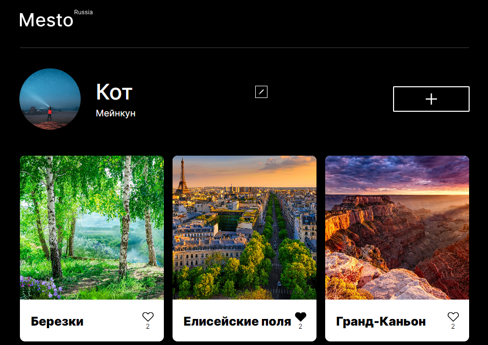

<h1 align="center">"Mesto React"</h1>
<h3 align="center">Четвертая проектная работа</h3>

## Описание проекта

Учебный проект от [Я.Практикум](https://practicum.yandex.ru/web/) предтставляет собой интерактивный одностраничный сайт на React, где можно добавлять фотографии, удалять их и ставить лайки.

## Функционал:

- Редактирование аватара и профиля;
- Добавление фотографии и лайков;
- Удаление фотографии и лайков;
- Открытие фотографии в режиме просмотра.

Данный проект был разделен на 2 основные части:

1. Портирование кода на React

2. Портирование кода и работа с API

<h3 align="center">1. Портирование кода на React</h3>

Данный этап включал в себя следующие дейтсвия:
- Конвертация HTML в JSX;
- Портирование стилей и изображений из [репозитория](https://github.com/elislis7/mesto);
- Портирование модуля API;
- Создание функциональных компонентов;
- Использование декларативного подхода;

<h3 align="center">2. Портирование кода и работа с API</h3>

Второй этап заключался в:
- Использование стейт-переменных;
- Создание объекта контекста и использование провайдера;
- Сохранение данных в API;
- Использование рефа;

## Ссылки на макеты Figma
1. [Макет 1](https://www.figma.com/file/2cn9N9jSkmxD84oJik7xL7/JavaScript.-Sprint-4?type=design&node-id=0-1&mode=design&t=Rpvinq2OjHnumSG0-0)
2. [Макет 2](https://www.figma.com/file/bjyvbKKJN2naO0ucURl2Z0/JavaScript.-Sprint-5?type=design&node-id=0-1&mode=design&t=zLPzA7nNYKKA9tGK-0)
3. [Макет 3](https://www.figma.com/file/kRVLKwYG3d1HGLvh7JFWRT/JavaScript.-Sprint-6?type=design&node-id=0-1&mode=design&t=MM8BkcPe4woBpLlW-0)
4. [Макет 4](https://www.figma.com/file/PSdQFRHoxXJFs2FH8IXViF/JavaScript.-Sprint-9?type=design&node-id=0-1&mode=design&t=nVsn7FHArrx3pzTw-0)

<!-- ## [Ссылка на сайт]() -->

<h4 align="center">План по доработке проекта</h4>

- [ ] Сделать иконку для сайта;
- [ ] Сделать валидацию форм;
- [ ] Добавить всплывающие подтверждения для удаления карточек;